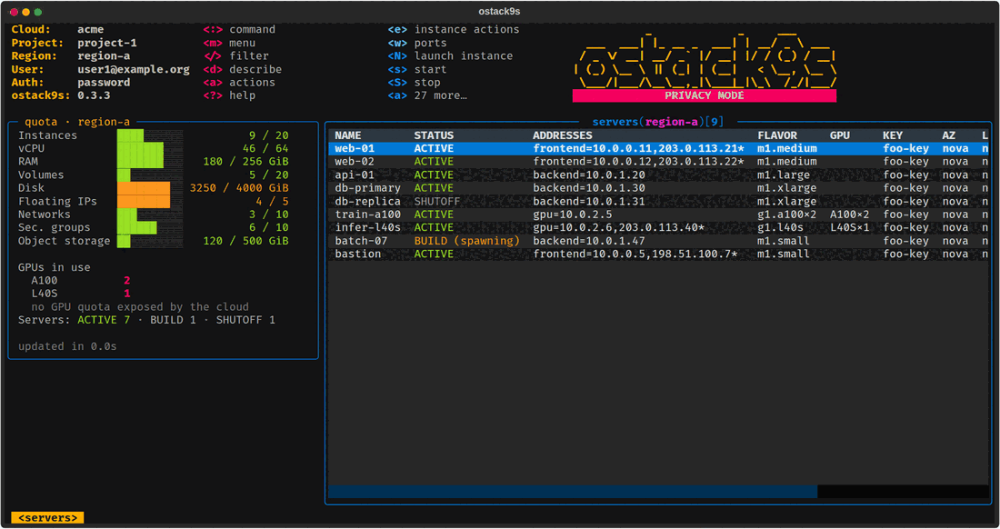
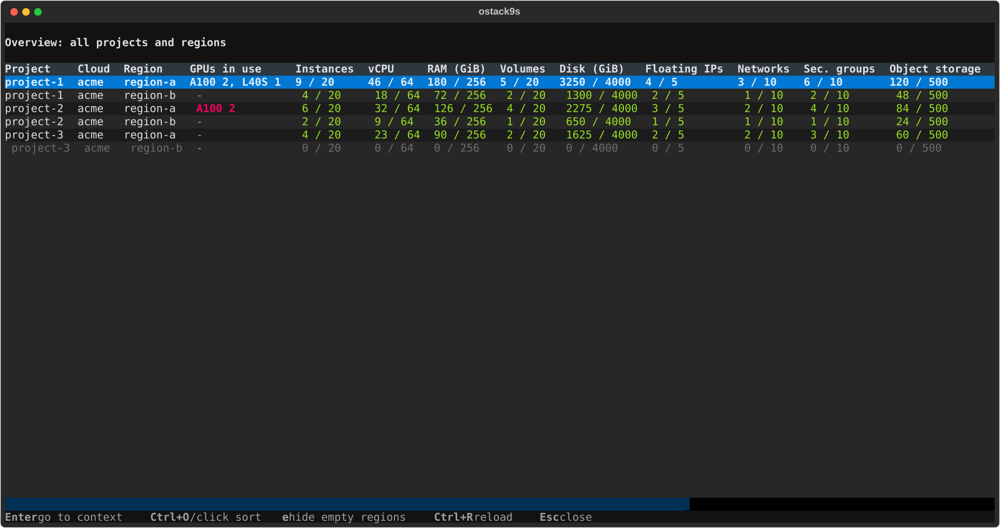
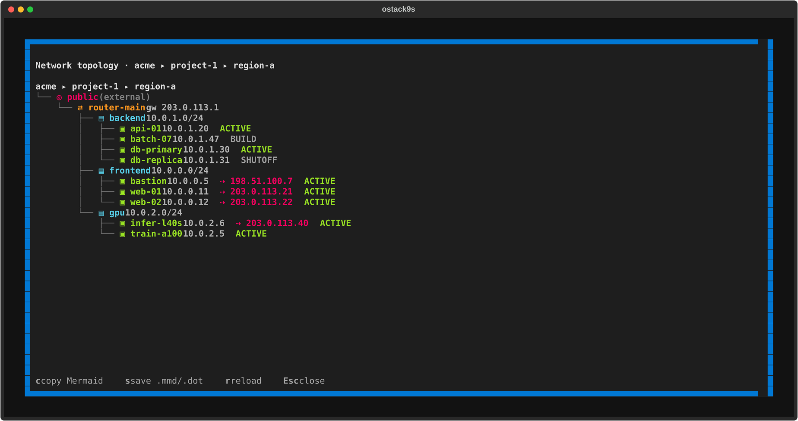

# ostack9s

[](https://github.com/rizlas/ostack9s/releases)
[](https://github.com/rizlas/ostack9s/actions/workflows/ci.yml)
[](LICENSE)

> **⚠️ AI-generated code.** This tool was written with AI assistance, on top of the
> public OpenStack APIs through openstacksdk. It works for the author's own clouds but
> has not been tested on every OpenStack deployment or policy setup. Review the code
> yourself before relying on it, especially since it can create, modify and delete cloud
> resources (servers, volumes, networks, …).

Fast, k9s style terminal dashboard for OpenStack: browse and manage servers, volumes,
networks, load balancers and more from the terminal, across projects and regions, with
the quotas of the current project always in sight.



<sub>Screenshots from fake data in privacy mode, generated by
`uv run python docs/screenshots.py`.</sub>

## Features

- **k9s style navigation**: `:` command bar with completion, `/` filter, one key menu
  (`m`), breadcrumbs, key hints in the header.
- **Horizon's Project panel from the terminal**: server lifecycle (launch, start/stop,
  reboot, resize, rebuild, snapshot, console), volumes, snapshots, backups, images,
  networks, routers, floating IPs, security groups, load balancers, containers, secrets,
  key pairs, application credentials.
- **Every project and region at hand**: switch with `:project` / `:region` or `[` `]`,
  global overview (`F1`) with sorting, quota panel with coloured bars and GPUs in use.
- **Describe pane** next to the table, updated while the cursor moves, and full screen
  YAML.
- **Network topology** as a tree, exportable to Mermaid and Graphviz.
- **What Horizon does not show**: search across every project and region, unused
  resources, security groups open to the internet, per volume type quotas, server group
  placement, expiring credentials (see [Beyond Horizon](#beyond-horizon)).
- **Fast**: token cache, list cache, parallel calls, prefetch of the other regions.
- **Privacy mode** for screencasts: masks public IPs, IDs, e-mails, keys, secrets.
- English interface, Italian available (`--lang it`).

## Installation

Every [release](https://github.com/rizlas/ostack9s/releases) ships a standalone binary
for Linux (x86_64, aarch64) and macOS (Apple Silicon, Intel): no Python needed on the
machine.

### Install script

Installs into `~/.local/bin`, no sudo needed. It picks the binary for your system,
checks it against `SHA256SUMS` and replaces an older version:

```bash
curl -fsSL https://github.com/rizlas/ostack9s/releases/latest/download/install.sh | sh
```

`VERSION=0.1.0` installs a given release, `PREFIX=/some/dir` another directory. Run it
again to upgrade.

### Manual install

Download the tarball for your system from the release page (`linux-x86_64`,
`linux-aarch64`, `darwin-arm64`, `darwin-x86_64`) and copy the binary into
`~/.local/bin`:

```bash
tar -xzf ostack9s-0.1.0-linux-x86_64.tar.gz
install -m 0755 ostack9s-0.1.0-linux-x86_64/ostack9s ~/.local/bin/ostack9s
```

For a system wide install use `/usr/local/bin` instead, with `sudo`.

### Linux packages, system wide

The `.deb` and `.rpm` packages install into `/usr/bin` for every user:

```bash
sudo apt install ./ostack9s_0.1.0_amd64.deb      # Debian, Ubuntu (or _arm64.deb)
sudo dnf install ./ostack9s-0.1.0-1.x86_64.rpm   # Fedora, RHEL (or .aarch64.rpm)
```

### Python package

```bash
uv tool install ostack9s-0.1.0-py3-none-any.whl  # wheel from the release, or: pipx
uv tool install .                                # from a clone of this repository
```

### Notes

- If the shell cannot find `ostack9s`, add `export PATH="$HOME/.local/bin:$PATH"` to
  `~/.zshrc` or `~/.bashrc`.
- Linux binaries are built on Ubuntu 22.04 and run on distributions with glibc 2.35 or
  newer. `SHA256SUMS` in each release lists the checksums of every file.
- macOS binaries (`darwin-arm64`, `darwin-x86_64`) are built as well, but Linux is the
  supported platform.

## Usage

Credentials are read from `clouds.yaml` with the standard openstacksdk lookup (current
directory, `~/.config/openstack/`, `/etc/openstack/`) or from `--config`. Only the first
file found is used: a `clouds.yaml` in the current directory hides the one in
`~/.config/openstack/`.

```bash
ostack9s                                          # asks which cloud if there are many
ostack9s --os-cloud foo --os-region region-b --view block_storage.volume
```

Main options: `--refresh SECONDS` (0 disables automatic refresh), `--timeout SECONDS`
for the APIs, `--lang en|it` (or `OSTACK9S_LANG`), `--privacy`, `--no-token-cache`,
`--log FILE` for debugging.

### Layout

- **Header**: cloud, project, region, user and authentication type on the left; in the
  middle the keys available in the current view (magenta global keys, blue actions, cyan
  child resources, red destructive actions).
- **Command bar** (`:`): opens below the header, with completion (`Tab` accepts the
  suggestion). It moves between resources, regions, projects and clouds.
- **Quota panel** (F3 hides it): usage and limits of the project in the current region,
  with units and coloured bars (yellow above 75%, red above 90%), the volume and
  gigabyte quotas of each limited volume type, the Swift account usage, and the GPUs in
  use by model.
- **Table** titled `resource(scope)[rows]`, with the active filter.
- **Describe pane** (`d`): YAML of the highlighted row next to the table; `Tab` moves
  the focus into it.
- **Breadcrumbs** at the bottom with the navigation path.

### Command bar

| Command | Function |
|---|---|
| `:servers`, `:volumes`, `:nets`, `:sg`, `:fip`, … | open a resource (aliases in `:help`) |
| `:region <name>` (`:reg`) | switch region |
| `:project <name>` (`:proj`) | switch project |
| `:cloud <name>` (`:ctx`) | switch `clouds.yaml` entry |
| `:overview` (`:ov`) | every cloud × project × region; Enter switches context |
| `:topology` (`:topo`) | network topology of the project in the region |
| `:search <text>` (`:find`) | name, ID or IP address in every project and region |
| `:unused`, `:audit` | unused resources, security groups open to the internet |
| `:lang <en\|it>` | interface language |
| `:privacy [on\|off]` | privacy mode (also `Ctrl+P`) |
| `:menu`, `:help`, `:q` | resource menu, help, quit |

Without an argument, `:region`, `:project` and `:cloud` open a picker.

### Keys

| Key | Function |
|---|---|
| `:` | command bar |
| `m` | resource menu: one key jumps to servers, networks, routers, topology, … |
| `/` | filter rows; `Esc` clears |
| `Enter` | open the child resource (e.g. network → subnets) or the YAML details |
| `Esc` | clear the filter or go back to the previous view |
| `d` | describe pane; `Tab` switches focus between table and pane |
| `y` | full screen YAML (`c` copies it to the clipboard) |
| `a` | menu with every action of the resource |
| `?` | help with the keys of the current view |
| `[` / `]` | previous / next region |
| `Ctrl+O`, header click | sort by column |
| `Ctrl+R` | reload |
| `Ctrl+P` | privacy mode on/off |
| `F1` / `F2` / `F4` / `F5` | shortcuts for overview / cloud / project / region |
| `q` | quit |

Action conventions: `N` creates, `n` edits or renames, `Ctrl+D` deletes. Destructive or
disruptive operations ask for confirmation.

### Overview

`F1` (or `:overview`) lists every reachable project in every region with quotas, GPUs in
use and server states. Click a header or press `Ctrl+O` to sort: quota columns sort by
how full they are, so the most critical rows come first. `e` hides the regions where a
project has no resources, `Enter` switches to the selected context.



## Supported resources

| Service | Resources and actions |
|---|---|
| Compute | servers (with the fault message of ERROR servers): launch (also boot from volume, cloud-init), start/stop, soft/hard reboot, pause, suspend, shelve, lock, resize with confirm/revert, rebuild, snapshot, rename, console log, console URL (noVNC, SPICE or serial, whichever the cloud offers), attach/detach of volumes, interfaces, floating IPs and security groups, instance actions; flavors; key pairs (create/import); server groups (members, host placement check) |
| Block storage | volumes: create (also from image), extend, edit, snapshot, backup, attach/detach, bootable, upload to image, retype, delete; snapshots (volume from snapshot); backups (restore) |
| Image | list, edit name and visibility, delete |
| Network | networks (with subnet), subnets, routers (gateway, interfaces), ports (port security, allowed address pairs, trunks, QoS), floating IPs (allocate, associate, release), security groups and rules (ports using them), RBAC sharing of networks, network topology |
| Load balancer | load balancers, listeners, pools, members (navigation and delete) |
| Object storage | containers (create, upload, public/private, details, delete also when not empty), objects by folder (upload of files and directories, create folder, download, copy, metadata, expiry, temporary URL, details, delete also of folders) |
| Key manager | secrets (list, delete) |
| Identity | application credentials (create, delete, time left) |

Views follow the cloud policies: when an API answers 403, the table shows the error and
the rest of the application keeps working.

## Network topology

`:topology` (or `m` then `t`) shows the project network in the current region as a tree:
external networks, routers with their gateway, internal networks with their subnets, and
the servers attached to each network with fixed and floating IPs. `c` copies the diagram
as Mermaid (renders on GitHub and GitLab), `s` saves `topology-<project>-<region>.mmd`
and `.dot` (Graphviz) in the current directory, without overwriting existing files.



## Beyond Horizon

Things a regular user cannot see in Horizon, or only one page at a time:

- **Global search** (`:search <text>`, or `m` then `S`): name, ID or IP address in
  servers, ports, floating IPs, volumes, networks, subnets, routers, security groups and
  load balancers of every project and region. Results arrive as each context answers,
  exact matches in bold; `Enter` switches context and opens the resource filtered.
- **Unused resources** (`:unused`): floating IPs not associated, volumes not attached,
  snapshots older than 30 days, servers stopped for more than 7 days, ports without a
  device, routers with a gateway and no interfaces, security groups used by no port.
  `Ctrl+D` deletes the highlighted one (servers excepted).
- **Security group audit** (`:audit`): ingress rules open to `0.0.0.0/0` or `::/0` for
  all traffic, all ports, sensitive services (SSH, RDP, databases, Docker API, …) or
  ranges wider than 100 ports, with the number of ports using the group. The security
  group view counts the ports of each group and `w` lists them.
- **Per volume type quotas**: Cinder limits such as `gigabytes_<type>` appear in the
  quota panel and in the overview when they are not unlimited.
- **Server group placement**: members with their `hostId` (a per-project hash of the
  compute host) and a check of the policy: `VIOLATED` when anti-affinity members share a
  host, `SHARED_HOST` for soft anti-affinity.
- **Ports**: port security, allowed address pairs and trunk subports as columns, with
  actions to set the address pairs (`p`) and port security (`s`).
- **Network sharing**: RBAC policies of a network (`b` from the network, or `:rbac`),
  with actions to share it with a project and stop sharing.
- **Expirations**: time left of the token in the header, a warning at startup for
  application credentials expiring within 14 days, and a time left column in their
  view.
- **Fault message** of servers in ERROR directly in the server table.
- **Swift**: account usage against its quota (`X-Account-Meta-Quota-Bytes`) in the quota
  panel; storage policy, public or private access, quotas and versioning of each
  container; static large objects marked in the listing; expiry dates, large object
  manifests and every header in the details (`i`); temporary URLs (`t`).

### Object storage

`Enter` on a container opens its objects one folder at a time (folders first, `Enter`
opens a folder, `Esc` goes back up). `u` uploads a file or a whole directory into the
current folder: files larger than the Swift limit are uploaded as static large objects.
`N` creates a folder, `D` downloads, `c` copies to another name or container, `e` edits
the metadata, `x` sets an expiry in days, `t` gives a temporary URL (it can create the
account key when missing), `Ctrl+D` deletes an object or a folder with everything in it.
On a container `p` switches between public and private.

## GPUs

GPUs are counted from the flavors of the project's servers: PCI passthrough aliases
(`pci_passthrough:alias: gpu_a100:2`) and GPU resource classes (`resources:VGPU`,
`resources:CUSTOM_GPU_*`). The quota panel and the overview show the GPUs in use per
model, and the server and flavor tables have a GPU column. Nova exposes no GPU quota to
non-admin users, so no limit is shown.

## Credentials for several projects

- **Password** (`auth_type: password`, the default): one entry reaches every project of
  the user, and `:project` switches between them. When the entry has no password,
  ostack9s asks for it at startup and keeps it in memory only.
- **Application credentials** are bound to one project. Add one entry per project:
  entries with the same `auth_url` and user are grouped, so `:project` lists all of them
  and switches entry automatically.

```yaml
clouds:
  foo:
    auth_type: v3applicationcredential
    auth:
      auth_url: https://keystone.example.org:5000/v3
      application_credential_id: "…"
      application_credential_secret: "…"
    region_name: region-a
  bar:
    auth_type: v3applicationcredential
    auth:
      auth_url: https://keystone.example.org:5000/v3
      application_credential_id: "…"
      application_credential_secret: "…"
    region_name: region-a
```

### Importing credentials from Horizon

Create one application credential per project in Horizon (switch to the project,
Identity → Application Credentials → Create, then "Download clouds.yaml"). Every file is
named `clouds.yaml` and every entry inside is called `openstack`, so the browser saves
them as `clouds.yaml`, `clouds(1).yaml`, `clouds(2).yaml`, … Import them all at once:

```bash
ostack9s import ~/Downloads/clouds*.yaml --dry-run   # preview, writes nothing
ostack9s import ~/Downloads/clouds*.yaml             # write
```

```text
added     /home/user/Downloads/clouds.yaml:openstack -> foo (project foo)
added     /home/user/Downloads/clouds(1).yaml:openstack -> bar (project bar)
added     /home/user/Downloads/clouds(2).yaml:openstack -> baz (project baz)
backup: /home/user/.config/openstack/clouds.yaml.bak-20260929-212121
```

Files can also be listed one by one (quote the parentheses in the shell), mixed with
other `clouds.yaml` files with several entries, and written to another file:

```bash
ostack9s import ~/Downloads/clouds.yaml ~/Downloads/'clouds(1).yaml' \
    ~/work/team-clouds.yaml --prefix acme- --target ~/clouds-all.yaml
```

The result is one entry per project, e.g.:

```yaml
clouds:
  acme-foo:
    auth_type: v3applicationcredential
    auth:
      auth_url: https://keystone.example.org:5000/v3
      application_credential_id: "…"
      application_credential_secret: "…"
    region_name: region-a
  acme-bar:
    # …
```

Each credential is authenticated to learn its project, and the entry is named after it
(`--prefix` adds a prefix). The target (default `~/.config/openstack/clouds.yaml`, or
`--target`) gets a timestamped backup first; existing entries are kept and entries with
the same name are skipped unless `--replace` is given. Delete the downloaded files
afterwards: they contain the secrets.

## Speed

Most of the waiting time is spent by the OpenStack services, not on the network: on the
first call a service may take seconds (for example the Nova server list or the Neutron
quota details), later calls are much faster. ostack9s works around it on the client
side:

- Keystone tokens are cached in `~/.cache/ostack9s/tokens` (files readable by the user
  only) and reused until ten minutes before they expire, so a new run does not wait for
  a new token.
- Every list is cached: a view shows the last known rows at once and refreshes them in
  the background.
- The quota panel fills in as each service answers, and the quotas and the root view of
  the other regions are prefetched, so switching region is immediate.

## Privacy mode

For screencasts and demos, `--privacy`, `OSTACK9S_PRIVACY=1`, `:privacy` or `Ctrl+P`
mask what is displayed (never what is sent to OpenStack):

- public IPv4 and IPv6 addresses (private ranges such as 10.0.0.0/8 stay);
- e-mail addresses, user and project names;
- UUIDs and other hexadecimal IDs, MAC addresses, fingerprints;
- SSH public keys, PEM blocks, secrets and passwords, tokens in URLs;
- extra words given with `--privacy-word WORD` (repeatable) or
  `OSTACK9S_PRIVACY_WORDS=a,b`.

Placeholders are consistent within a session: the same address always shows the same
fake value (from the documentation ranges 203.0.113.0/24 and 2001:db8::/32), so tables,
describe pane and topology stay coherent. The header shows a `PRIVACY MODE` badge while
it is active.

## Languages

The interface is in English; `--lang it`, `OSTACK9S_LANG=it` or `:lang it` switch it to
Italian at any time. Translations live in `src/ostack9s/locales/`; a test checks that
every string of the interface has an Italian translation.

## Development

```bash
uv sync
uv run ostack9s
uv run black src tests
uv run ruff check src tests
uv run ty check src
uv run pytest
packaging/build-binary.sh dist    # standalone binary in dist/ostack9s
```

To add a resource, declare a `ResourceKind` in `src/ostack9s/resources/` (list, columns,
actions, children) and add it to `KINDS`: the UI is generic. Labels are written in
English and translated through `ostack9s.i18n.t`.

### Releasing

Bump the version in `pyproject.toml` and `src/ostack9s/__init__.py`, then push a tag:

```bash
git tag v0.2.0 && git push origin v0.2.0
```

The `release` workflow checks that the tag matches the version, runs the checks, builds
the binaries (Linux x86_64 and aarch64, macOS arm64 and x86_64), the `.deb` and `.rpm`
packages and the wheel, and publishes them in a GitHub release with `SHA256SUMS` and
`install.sh`.

## About This Project

I was tired of how slow Horizon is, and I wanted something fast and always at hand in my
terminal, like k9s is for Kubernetes. ostack9s was born out of that personal need, using
the "vibe coding" technique. I decided to publish it because I believe it could be
useful to others as well. Although it wasn't initially designed for general use, I hope
it can serve a broader audience and provide value to anyone who finds it helpful.

---

Feel free to make pull requests, fork, destroy or whatever you like most. Any criticism
is more than welcome.

<br/>

<div align="center"></div>
<p align="center">#followtheturtle</p>
